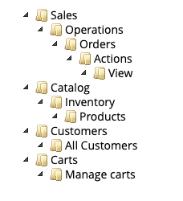

# Blueprint reference Magento 2 connector

This is a reference connector to import data from Magento 2 and send it to Blueprint via API. 
This is intended as a starting point for your own custom integration for your store.

## Capabilities of this connector

This connector periodically imports records that have been created or modified since the last run and sends them to Blueprint. The following record types are synced:

- Customers
- Products
- Orders

The intention is that the connector script is cronned to run every few minutes. The connector will maintain the timestamp of the last run in a state file (defaults to `state.json`) so that next time it runs it will only import modified records.

At any time you can force a resync by deleting the state.json file.

## Limitations of this reference connector

- Batch based - Not real time. Eg this could introduce a delay between an order and order confirmation SMS messages. This may be fixed in a later version by introducing a webhook event from Magento.
- No checkout links - We don't yet provide the ability to 'deeplink a magento 2 checkout'. This requires custom code to be installed on the server.
- No carts / abandoned carts - the cart record type is not yet implemented.
- Order fulfillment / shipments not yet implemented.

## How to use
There is a single php script that should be called with the following parameters:

```
php run-sync.php --magentoBaseUrl=http://your.store/ --magentoApiToken=xxxx --magentoStoreId=1 --blueprintApiKey=yyy
```

- `magentoBaseUrl` should be the base of your magento store. It will be used for calculating the API and image URLs.
- `magentoApiToken` Magento REST API integration access token.
- `magentoStoreId` We only support one Magento store per integration, this is the numeric store ID
- `blueprintApiKey` Blueprint API key from the integrations section of your dashboard

## Creating Magento 2 API access token

- Go to admin
- Go to System -> integrations
- Click 'add new integration' and enter name
- Click API and add permissions for:
    - View customers
    - View orders
    - View products
    - Manage carts
- Click save and authorize and record the 'access token'



## Products and variants

In Magento products can be children of other products. In the case where there is a single configurable product with multiple variant 'simple' products belonging to it, 
Magento models this as multiple products, where as Blueprint has a single product record with multiple variants within.

In this implementation, we only import products that are visible in catalog and search as 'products' and if they are configurable products then it uses the `configurable_product_links` to 
lookup the simple products within and map as the `variants` array. Products use Magento numeric ID as id, variants use SKU.

Within orders, Magento creates 2 line items for a configurable product (a parent and child item). This connector will combine them into a single line item, where the product is the parent item and the variant is the child SKU.